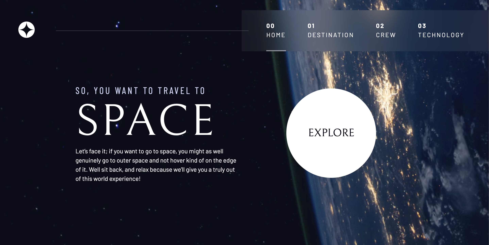

# Space tourism website

## Table of contents

- [Overview](#overview)
  - [The challenge](#the-challenge)
  - [Links](#links)
- [My process](#my-process)
  - [Built with](#built-with)
  - [What I learned](#what-i-learned)
- [Author](#author)
- [Acknowledgments](#acknowledgments)

## Overview

### The challenge

Users should be able to:

- View the optimal layout for each of the website's pages depending on their device's screen size
- See hover states for all interactive elements on the page
- View each page and be able to toggle between the tabs to see new information

### Links

- Solution URL: https://github.com/ellenycc/space-tourism-website-main/
- Live Site URL: https://ellenycc.github.io/space-tourism-website-main/

## My process

### Built with

- Semantic HTML5 markup
- CSS custom properties
- Flexbox
- CSS Grid
- Mobile-first workflow
- JavaScript

### What I learned

During this project, I learned that creating a design system with utility classes and custom properties at the beginning of the project can significantly speed up the process of building pages. To ensure responsiveness on different screen sizes,I adopted a mobile-first workflow. 

## Author

- Website - [Ellen Chan](https://ellenycc.github.io/portfolio/)

## Acknowledgments

This project was built with the assistance of Kevin Powell's course hosted on the interactive platform Scrimba.
